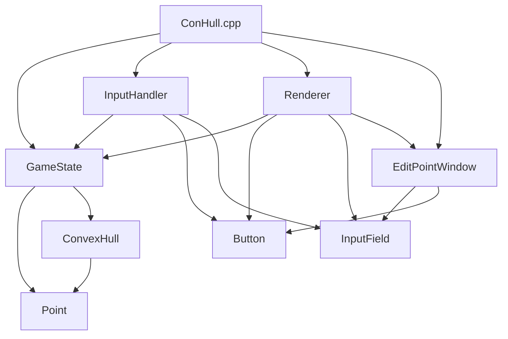

# Визуализация выпуклой оболочки (Алгоритм Грэхема)

## 📖 Постановка задачи
Реализовать программу в виде оконного приложения, реализующего ввод в графическое поле набора точек, построение на этом наборе точек минимальной выпуклой оболочки и вывод на экран результата.
Язык программирования — C++. Разрешается использовать любые доступные фреймворки для построения оконных приложений. Запрещается использовать готовые библиотечные решения для построения оболочек.

## 📝 Описание проекта
Данное приложение демонстрирует работу алгоритма Грэхема для построения минимальной выпуклой оболочки множества точек на плоскости. Пользователь может добавлять точки вручную, генерировать случайные наборы, редактировать координаты и наблюдать, как оболочка перестраивается в реальном времени.

## ⚙️ Технические требования
- **Язык:** C++17 / C++20
- **Библиотека:** SFML 3.x (Graphics, Window, System)
- **Сборка:** CMake 3.15+
- **Шрифт:** `resources/arial.ttf` (включён в репозиторий)
- **ОС:** Windows 10/11, Linux, macOS

## 🛠 Сборка и запуск

### 📦 Подготовка зависимостей
Убедитесь, что SFML 3 доступен в вашей системе:
- **Windows:** Скачайте готовые бинарники с [официального сайта SFML](https://www.sfml-dev.org/) или используйте vcpkg.
- **Linux:** `sudo apt install libsfml-dev` (Ubuntu/Debian) или аналог для вашего дистрибутива.
- **macOS:** `brew install sfml`

### 🚀 Сборка через CMake (кроссплатформенный способ)
```bash
# Создание папки сборки
mkdir build && cd build

# Конфигурация
cmake ..

# Компиляция
cmake --build . --config Release

# Запуск
Windows: .\Release\ConHull.exe
Linux/macOS: ./ConHull
```

### Windows
Важно: Укажите правильные пути к SFML (-I для заголовков, -L для библиотек). Если SFML установлен в другую папку, измените путь соответственно

#### Прямая компиляция через g++
```batch
:: Компиляция всех файлов + линковка SFML
g++ -std=c++17 -Wall -mwindows ^
    -I"C:\SFML\include" -L"C:\SFML\lib" ^
    ConHull.cpp ^
    Point.cpp GameState.cpp Renderer.cpp ^
    InputHandler.cpp Button.cpp InputField.cpp ^
    EditPointWindow.cpp ConvexHull.cpp ^
    -lsfml-graphics -lsfml-window -lsfml-system ^
    -o ConHull.exe

:: Копирование ресурсов (обязательно!)
xcopy /E /I resources resources\

:: Запуск
ConHull.exe
```
### С помощью Makefile (рекомендуется)
```batch
:: Создание папки сборки
mkdir build && cd build

:: Генерация проекта
cmake .. -G "MinGW Makefiles" -DSFML_DIR="C:/SFML/lib/cmake/SFML"

:: Сборка
cmake --build . --config Release

:: Копирование ресурсов
xcopy /E /I ..\resources Release\resources\

:: Запуск
Release\ConHull.exe
```
### Linux|macOS
```batch
# Создание папки сборки
mkdir build && cd build

# Генерация + сборка
cmake .. -DCMAKE_BUILD_TYPE=Release
cmake --build .

# Копирование ресурсов
cp -r ../resources ./

# Запуск
./ConHull
```

## 📊 Архитектура проекта


### 📁 Структура проекта 

Convex-Hull/  
├── src/                 # Исходный код (.cpp)  
│   ├── ConHull.cpp      # Точка входа, цикл обработки событий SFML 3 (main)  
│   ├── ConvexHull.cpp   # Алгоритм Грэхема  
│   ├── Renderer.cpp     # Отрисовка графики и UI  
│   ├── InputHandler.cpp # Обработка ввода мыши и клавиатуры  
│   ├── GameState.cpp    # Состояние приложения и конфигурация  
│   ├── Button.cpp       # UI-компонент: кнопка  
│   ├── InputField.cpp   # UI-компонент: поле ввода  
│   ├── EditPointWindow.cpp # Всплывающее окно редактирования точки  
│   └── Point.cpp        # Утилиты для работы с точками  
├── include/             # Заголовочные файлы (.h)  
├── resources/           # Ресурсы (arial.ttf)  
├── CMakeLists.txt       # Конфигурация сборки CMake  
├── ConHull.sln          # Решение Visual Studio  
└── README.md            # Этот файл  

### 🎮 Работа программы


### Генерация множества из случайных 20 точек


### Генерация множества из случайных 50 точек


### Пустое поле после нажатия кнопки "Очистить"


### Режим добавления точек


### Пошаговое удаление точек


### Режим изменения координат точки


